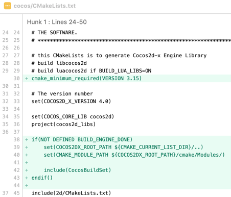
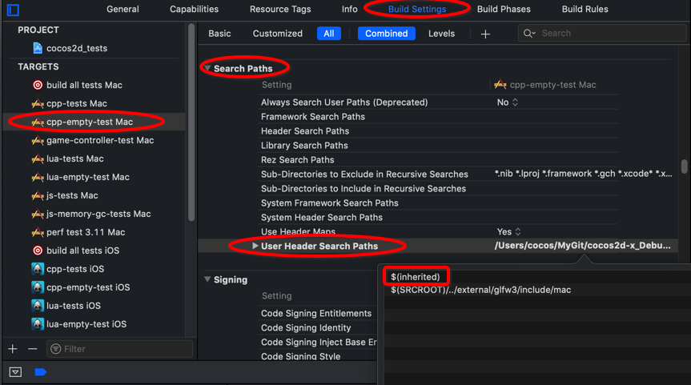
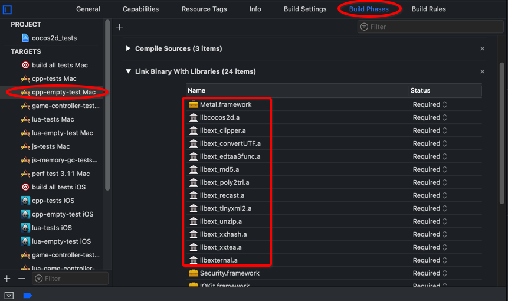

# Overview

- 如何将 v3 升级至 v4

  假定你有个基于 v3 引擎开发的工程，当你想从 v3 引擎升级至 v4 时，请参考教程 [v3 -> v4](#v3---v4)。

- 如何兼容 cocoapods

  由于 v4 全面使用 cmake 进行项目构建。因此当你想直接使用 v4 引擎从零开始开发一款项目，又额外需要 cocoapods 管理第三方库时，请参考教程  [cmake and cocoapods](#using-cmake-and-cocoapods)。

# Step by Step

## v3 -> v4

假设当前使用的是这个工程 `v3.17.2_path/cocos2d-x/build/cocos2d_tests.xcodeproj`，并且希望将 v3 引擎升级至 v4。

1. 拉取最新的 [v4](https://github.com/cocos2d/cocos2d-x/tree/v4) 分支。

2. [通过 cmake 构建项目](https://github.com/cocos2d/cocos2d-x/blob/v4/cmake/README.md#generate-macos-project)。

3. v4 项目工程位于 `cocos2d-x/build/engine/cocos/core/` 下。

   如果你想自己指定 v4 引擎的生成路径，参考如下设置：

   - 打开位于 `your_v4_path/cocos2d-x/cocos/` 路径下的 `CMakeLists.txt`，参考下图进行修改

     

   ```cmake
   cmake_minimum_required(VERSION 3.15)
   
   ...
   
   if(NOT DEFINED BUILD_ENGINE_DONE)
       set(COCOS2DX_ROOT_PATH ${CMAKE_CURRENT_LIST_DIR}/..)
       set(CMAKE_MODULE_PATH ${COCOS2DX_ROOT_PATH}/cmake/Modules/)
   
       include(CocosBuildSet)
   endif()
   ```

   - 指定 v4 引擎项目路径

     在 `your_v4_path/cocos2d-x/cocos/` 路径下，执行 CMake 命令 

     ```cmake
     cmake -B newPath/build_V4_Engine -GXcode
     ```

     其中，`-B <path-to-build>` 表示显示地指定编译路径。

   - 至此，V4 引擎工程文件位于上述指定的路径下，即 `newPath/build_V4_Engine`。

4. 打开你基于 v3 引擎开发的项目工程（`cocos2d_tests.xcodeproj`），右键 v3 工程，删除对 v3 工程的引用，同时将 3 中路径下的 v4 工程拖拽至此。

5. 在 **PROJECT** 组选中 `cocos2d_tests`, 依次找到 **Build Settings** —> **Search Paths** —> **User Header Search Paths**，

   展开 **User Header Search Paths**, 鼠标双击 **Debug** 或 **Release**。

   

   在弹出的窗口中，删除原先 v3 工程的头文件搜索路径，并参考下表填入 v4 引擎所引用的头文件路径。

   ```c
   your_v4_path/cocos2d-x/cocos
   ```

   

   对于每个 target 的搜索路径（如 `cpp-empty-test Mac`），可以通过添加 `$(inherited)` 继承来自 project 的设置。

   

6. 选中 **TARGETS** 组, 依次找到 **Build Settings** —> **Linking** —> **Other Linker Flags**，

   展开 **Other Linker Flags**，双击 **Debug** 或 **Release**。

   在弹出的窗口中，参考下表填入 v4 引擎依赖的库文件。

   ```c
   //for you reference, following external library is target for iOS
   your_v4_path/cocos2d-x/external/Box2D/prebuilt/ios/libbox2d.a
   your_v4_path/cocos2d-x/external/jpeg/prebuilt/ios/libjpeg.a
   your_v4_path/cocos2d-x/external/freetype2/prebuilt/ios/libfreetype.a
   your_v4_path/cocos2d-x/external/webp/prebuilt/ios/libwebp.a
   your_v4_path/cocos2d-x/external/bullet/prebuilt/ios/libLinearMath.a
   your_v4_path/cocos2d-x/external/bullet/prebuilt/ios/libBulletDynamics.a
   your_v4_path/cocos2d-x/external/bullet/prebuilt/ios/libBulletCollision.a
   your_v4_path/cocos2d-x/external/bullet/prebuilt/ios/libLinearMath.a
   your_v4_path/cocos2d-x/external/bullet/prebuilt/ios/libBulletMultiThreaded.a
   your_v4_path/cocos2d-x/external/bullet/prebuilt/ios/libMiniCL.a
   your_v4_path/cocos2d-x/external/websockets/prebuilt/ios/libwebsockets.a
   your_v4_path/cocos2d-x/external/uv/prebuilt/ios/libuv_a.a
   your_v4_path/cocos2d-x/external/openssl/prebuilt/ios/libssl.a
   your_v4_path/cocos2d-x/external/glsl-optimizer/prebuilt/ios/libmesa.a
   your_v4_path/cocos2d-x/external/glsl-optimizer/prebuilt/ios/libglsl_optimizer.a
   your_v4_path/cocos2d-x/external/glsl-optimizer/prebuilt/ios/libglcpp-library.a
   your_v4_path/cocos2d-x/external/png/prebuilt/ios/libpng.a
   your_v4_path/cocos2d-x/external/curl/prebuilt/ios/libcurl.a
   your_v4_path/cocos2d-x/external/openssl/prebuilt/ios/libcrypto.a
   your_v4_path/cocos2d-x/external/chipmunk/prebuilt/ios/libchipmunk.a
   your_v4_path/cocos2d-x/external/glfw3/prebuilt/ios/libglfw3.a
   ```

7. 选中 **TARGETS** 组, 找到 **Build Phases**

   - 展开 **Target Dependecies**, 单击 "+" 按钮。在弹出的窗口中找到 **cocos2d**，单击 **Add** 添加到项目中。

     

   - 展开 **Link Binary With Libraries**, 单击"+" 按钮。在弹出的窗口中添加 **Metal.framewrok**，**libcocos2d.a** 以及 第三方库（通常包含 “libext” 字样）。

     

8. 重新编译即可。

##  cmake and cocoapods

1. 拉取最新 [v4](https://github.com/cocos2d/cocos2d-x/tree/v4) 代码.

2. [使用 cmake 构建项目](https://github.com/cocos2d/cocos2d-x/blob/v4/cmake/README.md#generate-macos-project).

3. 打开构建好的项目, 选择 **TARGETS** 组, 找到 **Build Settings**

   - 在 **Linking** 栏目下添加 `$(inherited)` 到 **Other Linker Flags**。
   - 在 **Search Paths** 栏目下添加 `$(inherited)` 到 **Header Search Paths** 和 **Library Search Paths**。
   - 在 **Apple Clang - Preprocessing** 栏目下添加 `$(inherited)` 到 **Preprocessor Macros**。

4. [安装 CocoaPods](https://cocoapods.org/).

5. 创建默认的 Podfile

   ```cmake
   pod init
   ```

6.  编写 [Podfile](https://guides.cocoapods.org/using/the-podfile.html)，管理第三方库。

7. [安装 pods](https://guides.cocoapods.org/using/pod-install-vs-update.html).

   ```cmake
   pod install
   ```

8. 打开 `.xcworkspace` 并编译，不出意外的话，编译报错： `error: ../gamePods/Pods/Target Support Files/Pods-gamePods/Pods-gamePods.debug.xcconfig: unable to open file (in target "gamePods" in project "gamePods") (in target 'gamePods')`

   报错的原因在于 `.xcworkspace` 中指向的 `Pods-gamePods.debug.xcconfig`路径 与该文件所在路径不一致导致的。因此，我们在  `.xcworkspace` 中选中 **Pods** 文件夹, 在 xcode 工程面板的右侧找到对应的文件，单击 “文件夹” 图样的按钮，添加 `Pods-gamePods.debug.xcconfig` 文件所在路径即可。（通常 Pods 与 `.xcworkspace` 在同一级目录）。

9. 重新编译，提示新的错误, `error: The sandbox is not in sync with the Podfile.lock. Run 'pod install' or update your CocoaPods installation.`

   报错的原因在于 `PODS_PODFILE_DIR_PATH` 和 `PODS_ROOT` 环境变量有误。因此，打开 *.xcconfig* 文件，将文件末尾的两个环境变量 **PODS_PODFILE_DIR_PATH** and **PODS_ROOT** 挪到该文件的头两行，并参考下表修改。

   ```cmake
   PODS_PODFILE_DIR_PATH = ${SRCROOT}/"path_of_Pods"
   PODS_ROOT = ${SRCROOT}/"path_of_Pods"/Pods
   ```

   "path_of_Pods" 指的是 **Pods** 所在的目录，通常是你工程编译的目录。

10. 重新编译，编译成功。


